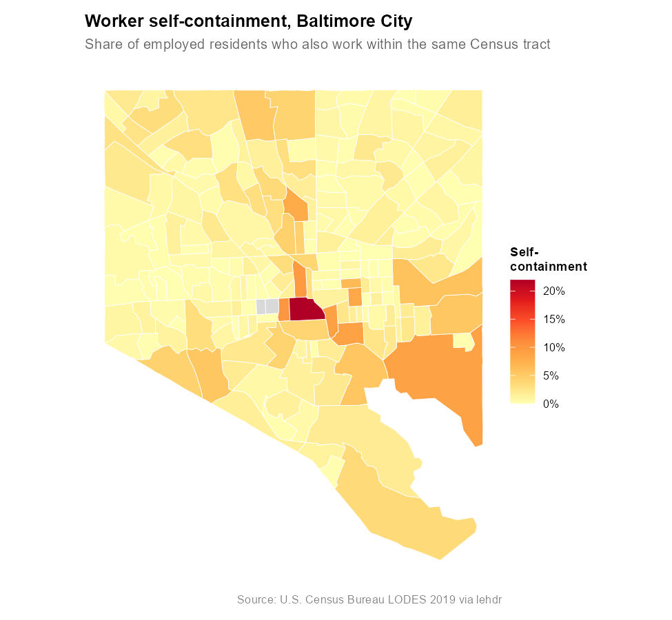
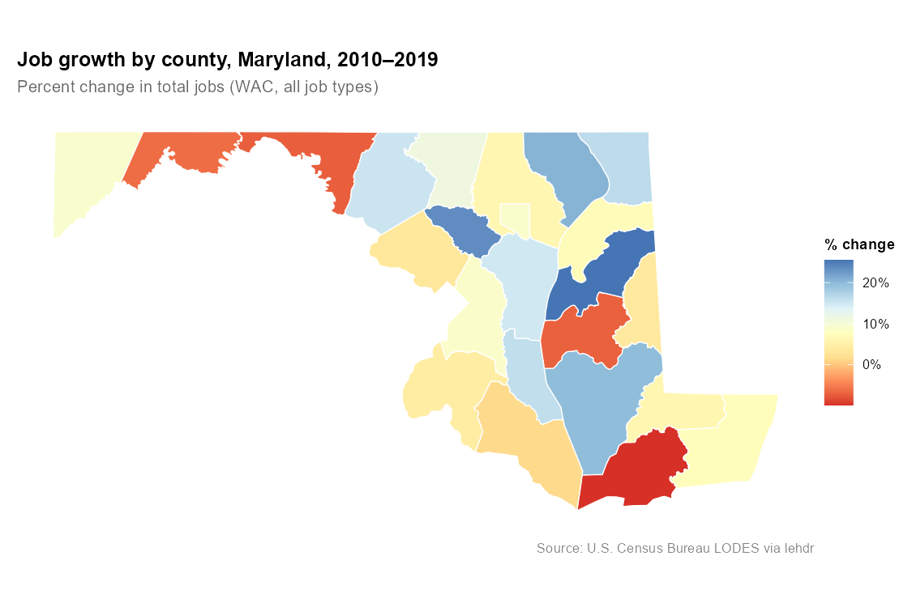
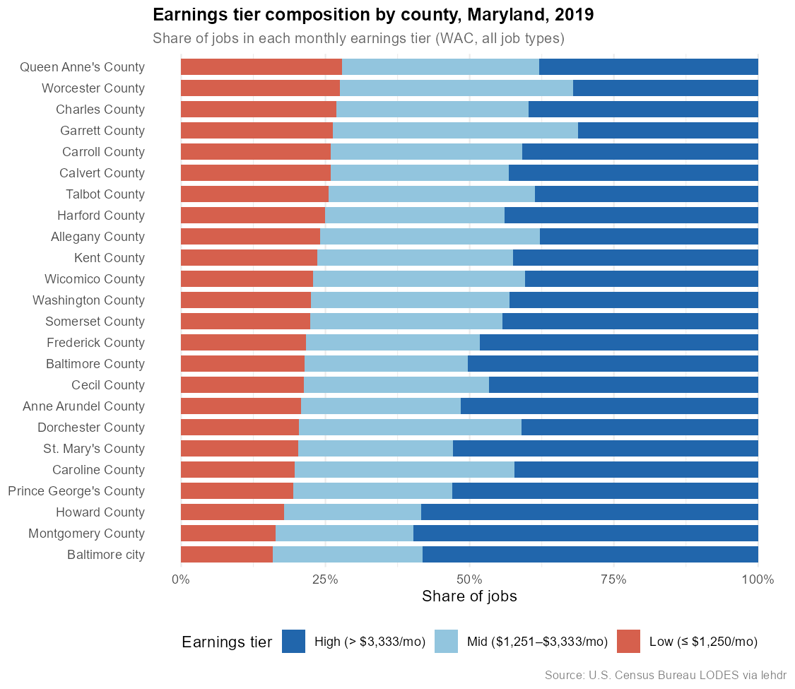
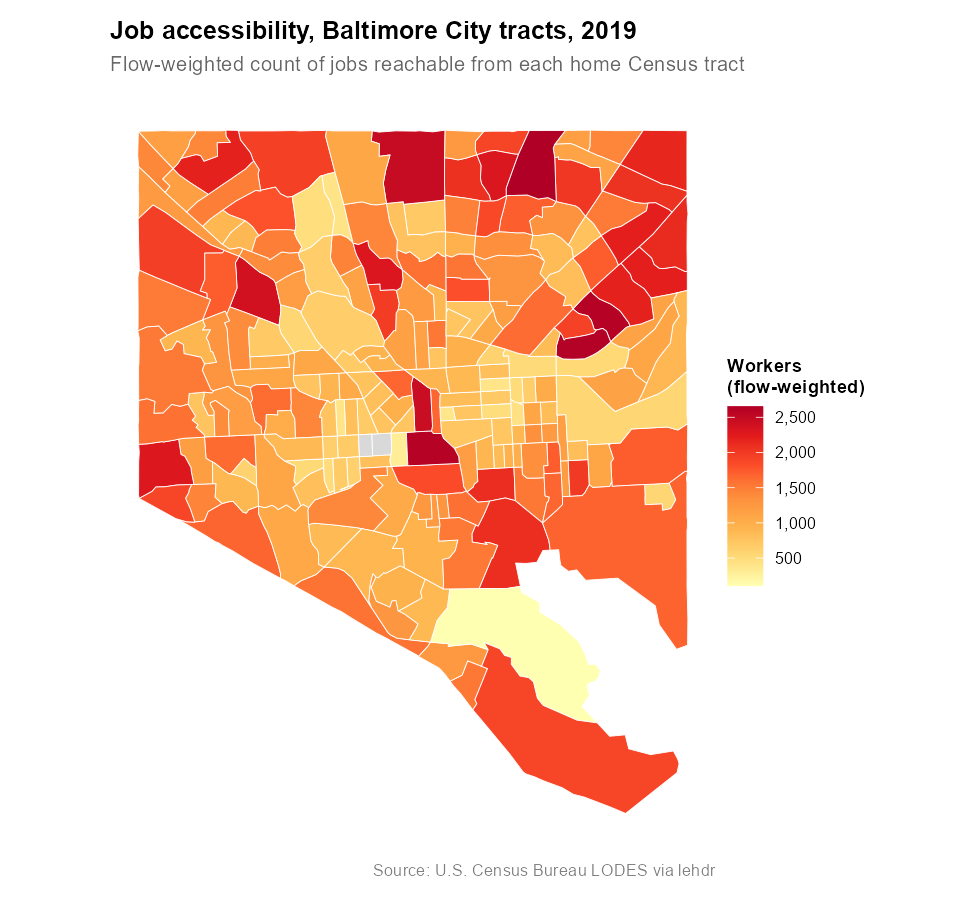

```{r setup, echo=FALSE, message=FALSE, warning=FALSE}
knitr::opts_chunk$set(
  collapse  = TRUE,
  comment   = "#>",
  eval      = FALSE
)
```

## Introduction

**lehdr** is an R package that provides programmatic access to the
[Longitudinal Employer-Household Dynamics (LEHD)](https://lehd.ces.census.gov/data/#lodes)
Origin-Destination Employment Statistics (LODES) dataset. LODES forms the
backbone of the U.S. Census Bureau's
[OnTheMap](https://OnTheMap.ces.census.gov/) web application, which maps
commuting patterns at fine geographic scales. While OnTheMap is a useful
exploratory tool, it does not support systematic comparisons over time or
across geographies. **lehdr** fills that gap by exposing LODES downloads as
tidy data frames and providing built-in functions for common analyses.

LODES contains three file types:

- **OD** (`lodes_type = "od"`): Origin-destination flows, giving the number
  of workers by home-workplace Census block pair.
- **RAC** (`lodes_type = "rac"`): Residential area characteristics, giving
  job totals at workers' home blocks.
- **WAC** (`lodes_type = "wac"`): Workplace area characteristics, giving
  job totals at workers' job blocks.

## Installation

```{r install, eval=FALSE}
# From CRAN
install.packages("lehdr")

# Development version from GitHub
devtools::install_github("jamgreen/lehdr")

library(lehdr)
library(dplyr)
```

## Basic Usage

### Downloading a single state and year

The following example retrieves 2020 Oregon OD data aggregated to the Census
tract level. Only primary jobs (`job_type = "JT01"`) across all worker
segments (`segment = "S000"`) are included.

```{r usage_basic}
or_od <- grab_lodes(
  state      = "or",
  year       = 2020,
  lodes_type = "od",
  job_type   = "JT01",
  segment    = "S000",
  state_part = "main",
  agg_geo    = "tract"
)

head(or_od)
```

### Multiple states and years

Pass character vectors to `state` and/or numeric vectors to `year`. The
function returns a single bound tibble across all combinations.

```{r usage_multi}
or_ri_od <- grab_lodes(
  state      = c("or", "ri"),
  year       = c(2019, 2020),
  lodes_type = "od",
  job_type   = "JT01",
  segment    = "S000",
  state_part = "main",
  agg_geo    = "tract"
)

head(or_ri_od)
```

Not all state-year combinations are available for every LODES version. Consult
the [LEHD Technical Document](https://lehd.ces.census.gov/data/lodes/LODES8/)
for availability.

### Aggregation levels

`agg_geo` controls the output geography. Valid values are `"block"` (default),
`"bg"` (block group), `"tract"`, `"county"`, and `"state"`. Aggregation
truncates GEOID strings and sums all numeric columns.

```{r usage_agg}
md_rac_county <- grab_lodes(
  state      = "md",
  year       = 2019,
  lodes_type = "rac",
  job_type   = "JT01",
  segment    = "S000",
  agg_geo    = "county"
)

head(md_rac_county)
```

### Attaching spatial geometries

Set `geometry = TRUE` to retrieve Census geometries via the `tigris` package
and attach them to the result. For `lodes_type = "rac"` or `"wac"`, the
return value is an `sf` object. For `lodes_type = "od"`, two geometry columns
(`h_geometry`, `w_geometry`) are added but the object remains a tibble ---
use `sf::st_as_sf()` to promote it.

```{r usage_geometry}
md_wac_sf <- grab_lodes(
  state      = "md",
  year       = 2019,
  lodes_type = "wac",
  job_type   = "JT01",
  segment    = "S000",
  agg_geo    = "county",
  geometry   = TRUE
)

plot(md_wac_sf["C000"])
```

### Geographic crosswalk

`grab_crosswalk()` downloads the LODES geographic crosswalk, which maps
Census blocks to all higher-level geographies. Useful when you need custom
aggregations not covered by `agg_geo`.

```{r usage_xwalk}
vt_xwalk <- grab_crosswalk("vt")

# LODES7 vintage crosswalk (2010 Census blocks)
vt_xwalk_7 <- grab_crosswalk("vt", version = "LODES7")
```

---

## Analytical Functions

lehdr includes three functions for common LODES analyses. All examples below
use Maryland, which has a rich and varied labor market geography: a large
central city (Baltimore), dense inner suburbs, agricultural Eastern Shore
counties, and strong federal-sector employment in the Washington suburbs.

### Commute flow statistics

`compute_commute_stats()` summarizes commute flows from an OD dataset into
per-geography metrics: workers arriving (inflow), workers departing (outflow),
internal flows, net flow, and the self-containment ratio. Self-containment is
the share of employed residents who also work within the same geographic unit
--- a value close to 1 indicates a largely self-sufficient labor market, while
values near 0 indicate heavy out-commuting.

```{r commute_stats}
od_md <- grab_lodes(
  state      = "md",
  year       = 2019,
  lodes_type = "od",
  job_type   = "JT00",
  segment    = "S000",
  state_part = "main",
  agg_geo    = "county"
)

commute_md <- compute_commute_stats(od_md, agg_geo = "county")

# Most self-contained counties
commute_md %>%
  arrange(desc(self_containment)) %>%
  select(county, workers_in, workers_out, net_flow, self_containment) %>%
  head(10)
```

Net flow identifies counties that are net job importers (positive) versus
net exporters (negative), a key indicator of job/housing imbalance. The map
below shows self-containment at the Census tract level for Baltimore City,
where the pattern reflects the city's mix of dense employment centers and
residential neighborhoods with limited local job access.

```{r fig1, eval=FALSE, echo=TRUE}
# See data-raw/render_vignette_figures.R for the full figure code.
# Requires: ggplot2, sf, tigris, scales
```

```{r fig1-display, echo=FALSE, eval=TRUE}

```

### Longitudinal change

`compute_lodes_change()` computes absolute and percentage change in any LODES
variable between two years. The output can be wide (one row per geography,
with columns for each variable's change) or long (one row per
geography-variable combination, suitable for `ggplot2`).

```{r lodes_change}
wac_md_panel <- grab_lodes(
  state      = "md",
  year       = c(2010, 2019),
  lodes_type = "wac",
  job_type   = "JT00",
  segment    = "S000",
  agg_geo    = "county"
)

change_md <- compute_lodes_change(
  wac_md_panel,
  geo_col      = "w_county",
  base_year    = 2010,
  compare_year = 2019,
  variables    = c("C000", "CE01", "CE02", "CE03")
)

# Counties with the largest absolute job growth
change_md %>%
  arrange(desc(C000_change)) %>%
  select(w_county, C000_base, C000_compare, C000_change, C000_pct_change) %>%
  head(10)
```

The map below shows the percent change in total jobs (`C000`) across Maryland
counties from 2010 to 2019. The diverging palette highlights counties that
gained jobs (blue) versus those that lost jobs (red) over the period.

```{r fig2, eval=FALSE, echo=TRUE}
# See data-raw/render_vignette_figures.R for the full figure code.
# Requires: ggplot2, sf, tigris, scales
```

```{r fig2-display, echo=FALSE, eval=TRUE}

```

Long format is useful for visualizing change across multiple variables at
once:

```{r lodes_change_long}
change_long <- compute_lodes_change(
  wac_md_panel,
  geo_col   = "w_county",
  output    = "long",
  variables = c("CE01", "CE02", "CE03")
)

# Suitable for use with ggplot2 facets or grouped geom_col()
head(change_long)
```

### Earnings tier shares

`compute_earnings_share()` computes the distribution of jobs (or resident
workers) across three monthly earnings tiers defined by LODES:

| Column | Tier  | Monthly earnings        |
|--------|-------|-------------------------|
| `CE01` | Low   | Up to $1,250            |
| `CE02` | Mid   | $1,251 to $3,333        |
| `CE03` | High  | Above $3,333            |

Both WAC and RAC files include these columns; `type` controls only the
geography prefix used for auto-detection (`w_` for WAC, `h_` for RAC).

```{r earnings_share}
wac_md <- grab_lodes(
  state      = "md",
  year       = 2019,
  lodes_type = "wac",
  job_type   = "JT00",
  segment    = "S000",
  agg_geo    = "county"
)

earn_shares <- compute_earnings_share(wac_md, type = "wac", geo_col = "w_county")

# Counties with the highest share of low-wage jobs
earn_shares %>%
  arrange(desc(share_low)) %>%
  select(w_county, share_low, share_mid, share_high) %>%
  head(10)
```

Use `output = "long"` to get a format ready for stacked bar charts:

```{r earnings_share_long}
earn_long <- compute_earnings_share(
  wac_md,
  type    = "wac",
  geo_col = "w_county",
  output  = "long"
)

head(earn_long)
```

The chart below shows the earnings tier composition for all Maryland counties
in 2019, sorted by the share of low-wage jobs. Counties with a larger
low-wage share tend to be more rural or tourism-dependent, while suburban
counties closer to Washington, D.C. show higher shares of well-paid jobs.

```{r fig3, eval=FALSE, echo=TRUE}
# See data-raw/render_vignette_figures.R for the full figure code.
# Requires: ggplot2, tigris, scales
```

```{r fig3-display, echo=FALSE, eval=TRUE}

```

Combining `compute_earnings_share()` and `compute_lodes_change()` supports
longitudinal tracking of wage polarization. Compute shares for each year
separately, then join and difference:

```{r earnings_share_change}
wac_panel <- grab_lodes(
  state      = "md",
  year       = c(2010, 2019),
  lodes_type = "wac",
  job_type   = "JT00",
  segment    = "S000",
  agg_geo    = "county"
)

share_2010 <- compute_earnings_share(
  dplyr::filter(wac_panel, year == 2010),
  type = "wac", geo_col = "w_county"
)

share_2019 <- compute_earnings_share(
  dplyr::filter(wac_panel, year == 2019),
  type = "wac", geo_col = "w_county"
)
```

---

## Mapping LODES Data

The figures in this vignette were produced with `ggplot2` and Census
geometries from the `tigris` package. The general pattern is:

1. Download LODES data with `grab_lodes()`.
2. Compute a derived variable with one of the analytical functions above.
3. Fetch geometries with `tigris::tracts()`, `tigris::counties()`, etc.
4. Join on the GEOID column and plot with `geom_sf()`.

The following example shows a simple flow-weighted job accessibility index
for Baltimore City tracts. For each home tract, the metric sums the total
number of workers flowing to all reachable work tracts --- a proxy for labor
market connectivity that can be computed entirely from LODES OD data.

```{r accessibility}
od_md <- grab_lodes(
  state      = "md",
  year       = 2019,
  lodes_type = "od",
  job_type   = "JT00",
  segment    = "S000",
  state_part = "main",
  agg_geo    = "tract"
)

accessibility <- od_md %>%
  dplyr::filter(startsWith(h_tract, "24510")) %>%
  dplyr::group_by(h_tract) %>%
  dplyr::summarise(
    n_dest          = dplyr::n_distinct(w_tract),
    total_reachable = sum(S000, na.rm = TRUE),
    .groups         = "drop"
  )

head(accessibility)
```

`n_dest` captures the breadth of access (number of distinct job destinations
a tract sends workers to), while `total_reachable` is a flow-weighted measure
of aggregate connectivity. A full accessibility analysis typically incorporates
travel times or distances (see packages such as `r5r` or `accessibility`);
the LODES-only measure here is a useful starting point when network data are
unavailable.

```{r fig4, eval=FALSE, echo=TRUE}
# See data-raw/render_vignette_figures.R for the full figure code.
# Requires: ggplot2, sf, tigris, scales
```

```{r fig4-display, echo=FALSE, eval=TRUE}

```

---

## Caching

By default, downloaded files are deleted after reading. Setting
`use_cache = TRUE` retains files in the user-level cache directory
(`tools::R_user_dir("lehdr", "cache")`), which avoids re-downloading when
you call `grab_lodes()` repeatedly with the same parameters. You can also
set this option globally for a session:

```{r caching}
options(lehdr_use_cache = TRUE)
```

The cache filename includes the LODES version (e.g.,
`lodes8_md_wac_S000_JT00_2019.csv.gz`), so switching between LODES versions
will not serve stale data from a different vintage.

---

## Citation

If you use **lehdr** in published work, please cite it. Running
`citation("lehdr")` will return a BibTeX entry. In Chicago author-date style:

> Green, Jamaal, Liming Wang, and Dillon Mahmoudi. 2025. "lehdr: Grab
> Longitudinal Employer-Household Dynamics (LEHD) Flat Files." R package
> version 1.2.0. https://github.com/jamgreen/lehdr/
